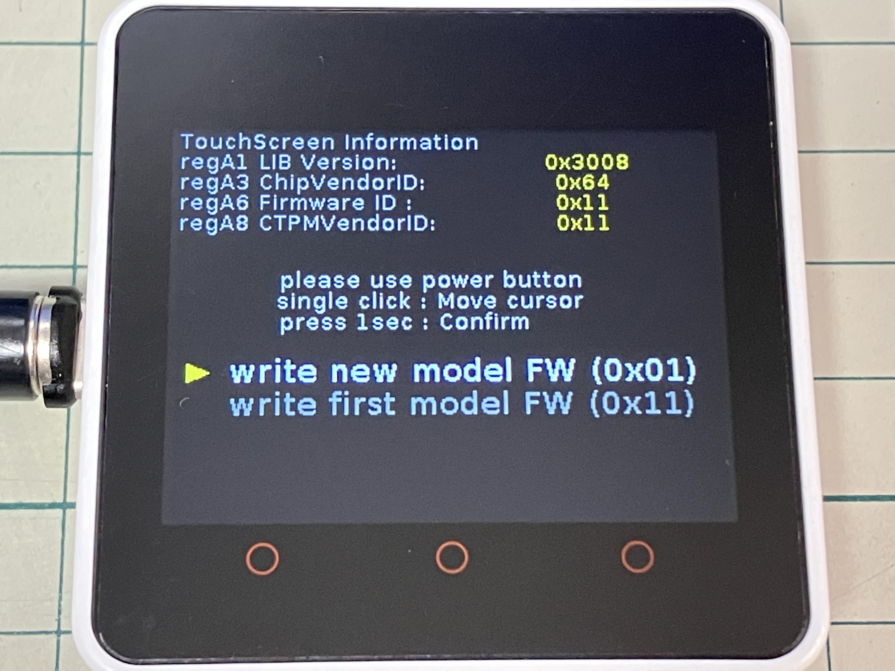

# M5Core2 TouchPanel Recovery

## Description

This tool recovery the internal firmware of the touchscreen on the M5Core2.

 - It can revive touchscreens that have stopped functioning due to malfunctioning M5Tools or FactoryTest updaters.
 - Firmware specifications vary depending on the production period.
 - Writing firmware with different specifications will cause the touchscreen to stop functioning, but writing the correct firmware again will make it work again.
 - It can be written using M5Burner V3. Share code : `RIOdQichbB28kFCg`

## How to use

 - When you touch the screen, a dot is drawn where you touch it, confirming that the touchscreen is working.
 - If the touchscreen is not functioning, try writing firmware.
 - It is operated by the power button on the left side of the unit.
 - Click the power button to move the triangular cursor.
 - Press the power button for 1 second to confirm.
 - Two firmware versions are available, depending on when the unit was manufactured.
 - When the firmware write is executed, a progress bar appears and the device reboots after the write is complete.
 - Touch the screen to make sure the touchscreen is working.

